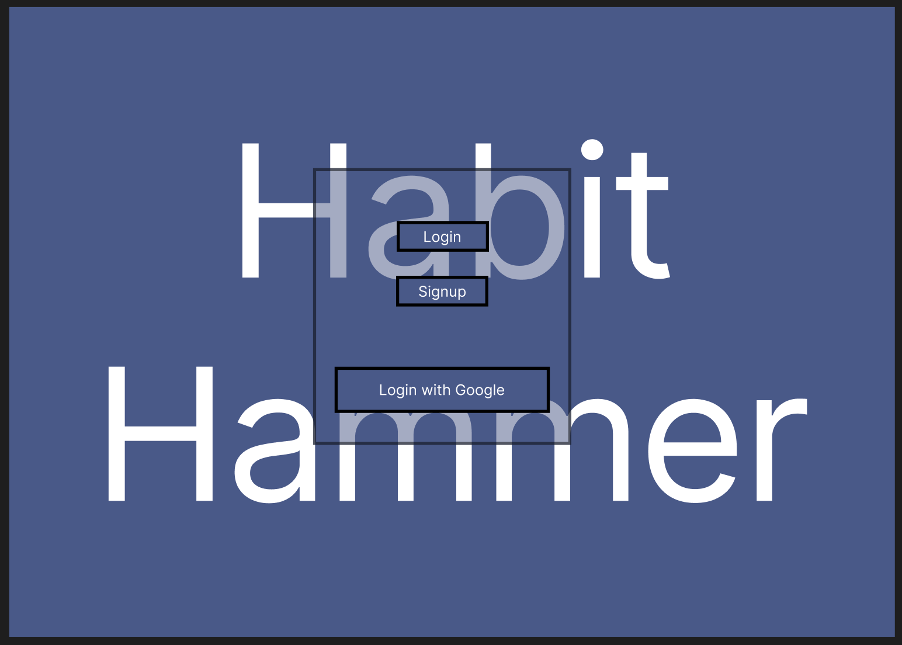
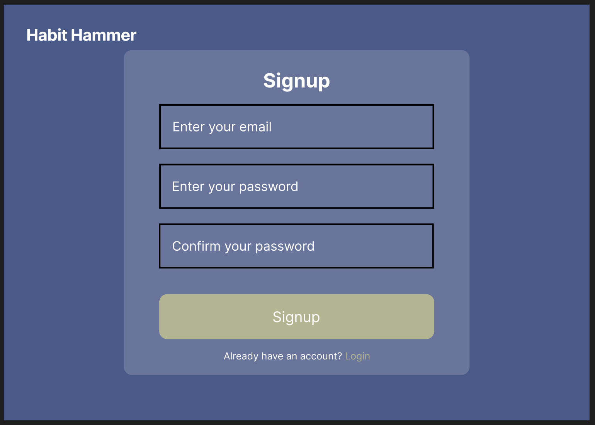
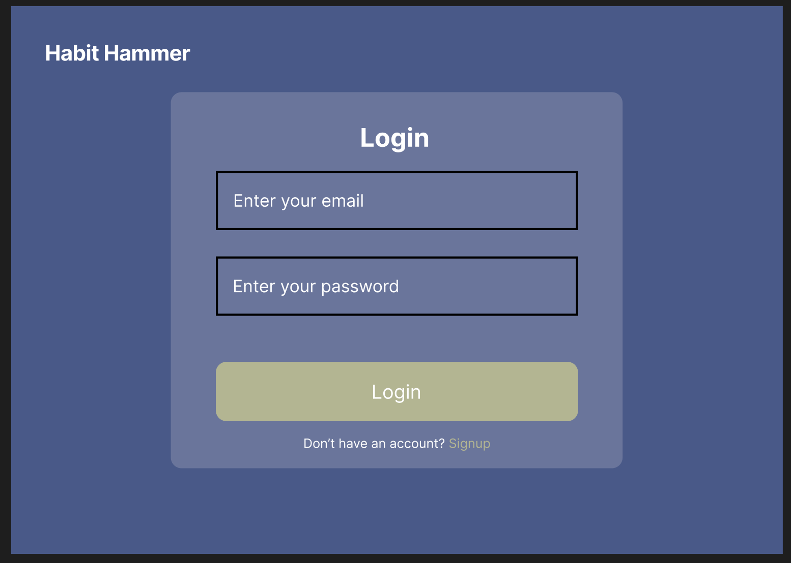
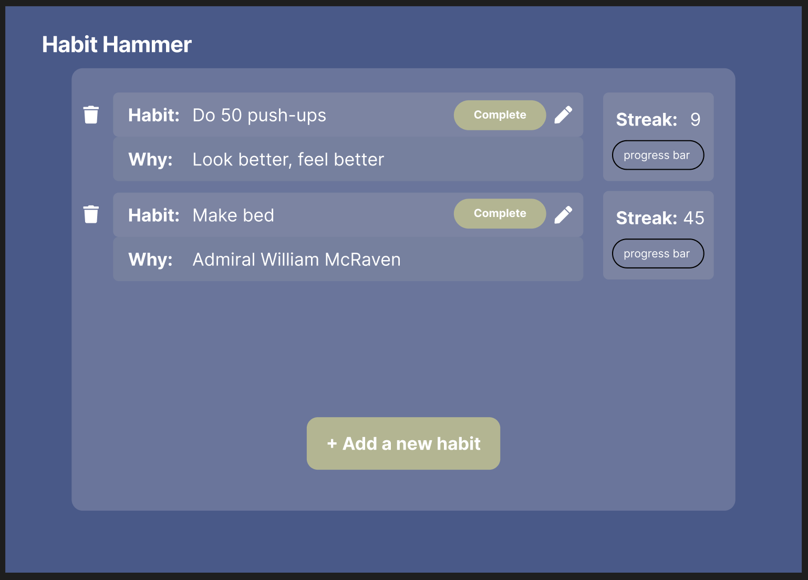
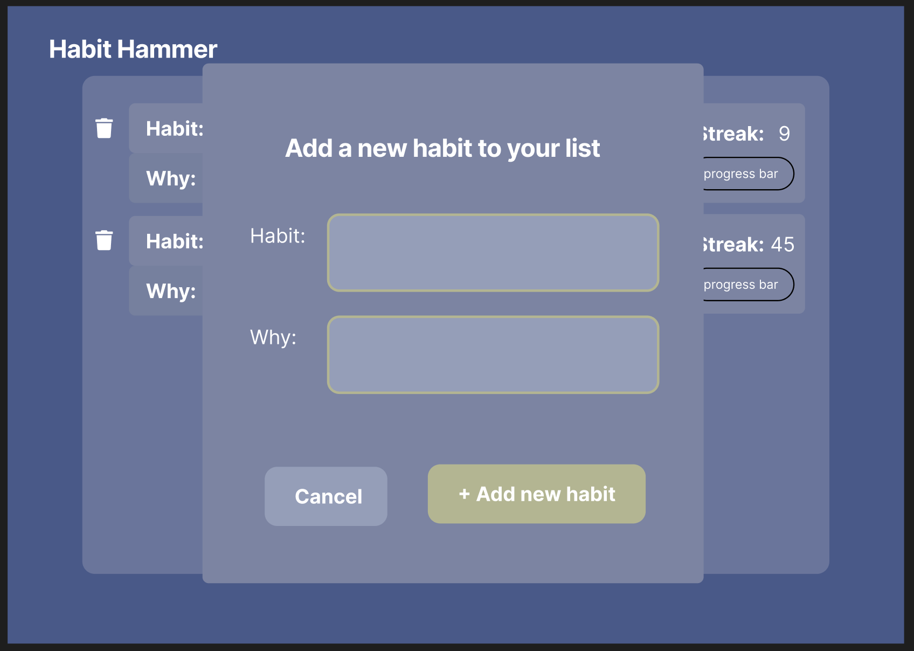
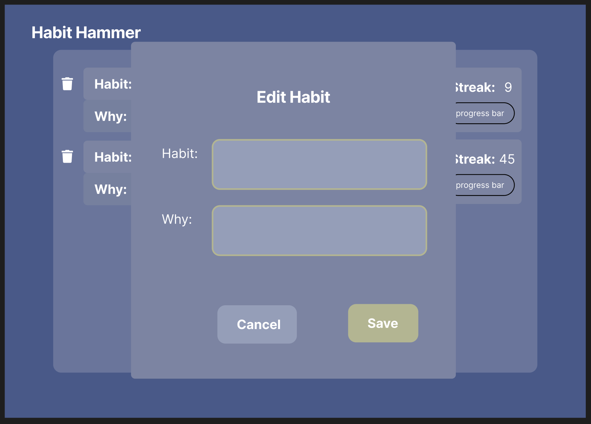
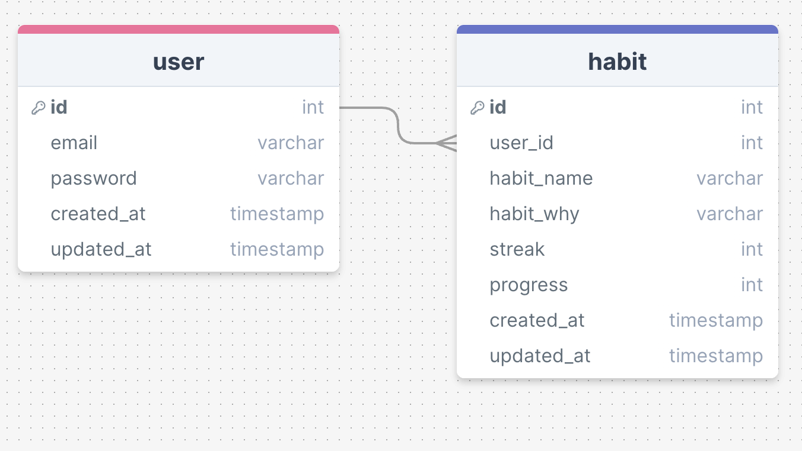

# Habit Hammer

## Overview

Habit Hammer is an app designed to help people form good daily habits.

### Problem

In the chaos of a normal day is can be difficult to remember and hold oneself accountable to forming new habits. Habit Hammer is designed with small habits in mind that the user wants to do on a daily basis, but usually finds themselves putting them off for latter and eventually never doing.
Habit Hammer aims to 'gamify' the process to enhance enjoyment and success probability.

### User Profile

People who want to improve their daily habits but struggle to maintain their new commitment after the initial excitment wears off or life gets in the way

### Features

- As a user, I want to be able to create an account to manage my habits
- As a user, I want to be able to login to my account to manage my habits

  - Create new habits
  - Update/edit habits
  - Delete habits

- As a user, I want to be able to track my completion streak for individual habits
- As a user, I want to be rewarded for daily completion
- As a user, I want to see a visual representation of completion/progress

## Implementation

### Tech Stack

- React
- MySQL
- Express
- Client libraries:
  - react
  - react-router
  - axios
- Server libraries:
  - knex
  - express
  - bcrypt for password hashing

### APIs

- No external APIs will be used for the first sprint

### Sitemap

- Home page
- Register
- Login
- Habit list
  - Add habit modal
  - Edit habit modal

### Mockups

#### Home Page



#### Register Page



#### Login Page



#### Habit List Page



#### Add New Habit Modal



#### Edit Habit Modal



### Data

#### SQL Diagram



### Endpoints

**GET /habits**

- Get the user's list of habits

Parameters:

- token: JWT or Google

Response:

```
[
    {
        "id": 1,
        "habit_name": "Do 50 push-ups",
        "habit_why": "Look better, feel better",
        "streak": 9,
        "progress": 80
    },
    ...
]
```

**POST /habits**

- Post a new habit to the user's list

Parameters:

- token: JWT or Google
- habit_name: habit that the user wants to develop - limit to 255 characters
- habit_why: reason for developing habit - limit to 255 characters

Response:

```
[
    {
        "id": 1,
        "habit_name": "Do 50 push-ups",
        "habit_why": "Look better, feel better",
        "streak": 9,
        "progress": 80
    },
    {
        "id": 2,
        "habit_name": "Make bed",
        "habit_why": "Admiral William McRaven",
        "streak": 0,
        "progress": 0
    }
]
```

**PUT /habit/:id**

- Edit one of the user's habits (habit_name or habit_why)

Parameters:

- token: JWT or Google
- id: id of the habit being edited
- habit_name: edited habit name - limit to 255 characters
  - Optional: if unchanged, send original
- habit_why: edited habit why - limit to 255 characters
  - Optional: if unchanged, send original

Response:

```
{
  "id": 1,
  "habit_name": "Do at least 50 push-ups",
  "habit_why": "Look better, feel better",
  "streak": 9,
  "progress": 80
}
```

**DELETE /habit/:id**

- Delete one of the user's habits (removes all habit data)

Parameters:

- token: JWT or Google
- id: id of the habit being edited

Response:

```
Headers:
{
  "status": 204
}
```

**POST /users/register**

- Add a user account

Parameters:

- email: User's email
- password: User's provided password

Response:

```
{
    "token": "seyJhbGciOiJIUzI1NiIsInR5cCI6IkpXVCJ9.eyJzdWIiOiIxMjM0NTY3ODkwIiwibmFtZSI6I..."
}
```

**POST /users/login**

- Login a user

Parameters:

- email: User's email
- password: User's provided password

Response:

```
{
    "token": "seyJhbGciOiJIUzI1NiIsInR5cCI6IkpXVCJ9.eyJzdWIiOiIxMjM0NTY3ODkwIiwibmFtZSI6I..."
}
```

### Auth

- JWT auth
  - Store JWT in localStorage, remove when a user logs out
- Google OAuth (optional alternative)

## Roadmap

- Create server

  - express project with routing, with placeholder responses

- Create migrations

- Create seeds with test habit data

- Create client

  - react project with routes and boilerplate pages

- Feature: Habit list

  - Create GET /habits endpoint
  - Create user habit list page

- Feature: Add new habit

  - Create POST /habits endpoint
  - Create "Add New Habit" modal

- Feature: Edit habit

  - Create PUT /habit/:id endpoint
  - Create "Edit Habit" modal

- Feature: Delete habit

  - Create DELETE /habit/:id endpoint
  - Implement delete button

- Feature: Home page

- Feature: Create account

  - Implement register page + form
  - Create POST /users/register endpoint

- Feature: Login

  - Implement login page + form
  - Create POST /users/login endpoint

- Feature: Implement JWT tokens and Google OAuth

  - Update server to check for tokens on protected endpoints
  - Update client to store tokens and include them in future requests to protected endpoints

- Bug fixes

- DEMO DAY

## Nice-to-haves

- more sophisticated progress/growth animatoins and graphics
- built-in timer
- convert into progressive web app
- reminders
- Facebook OAuth
- Password recovery
